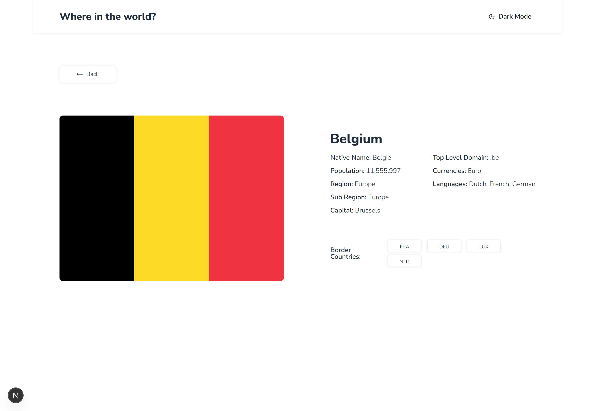
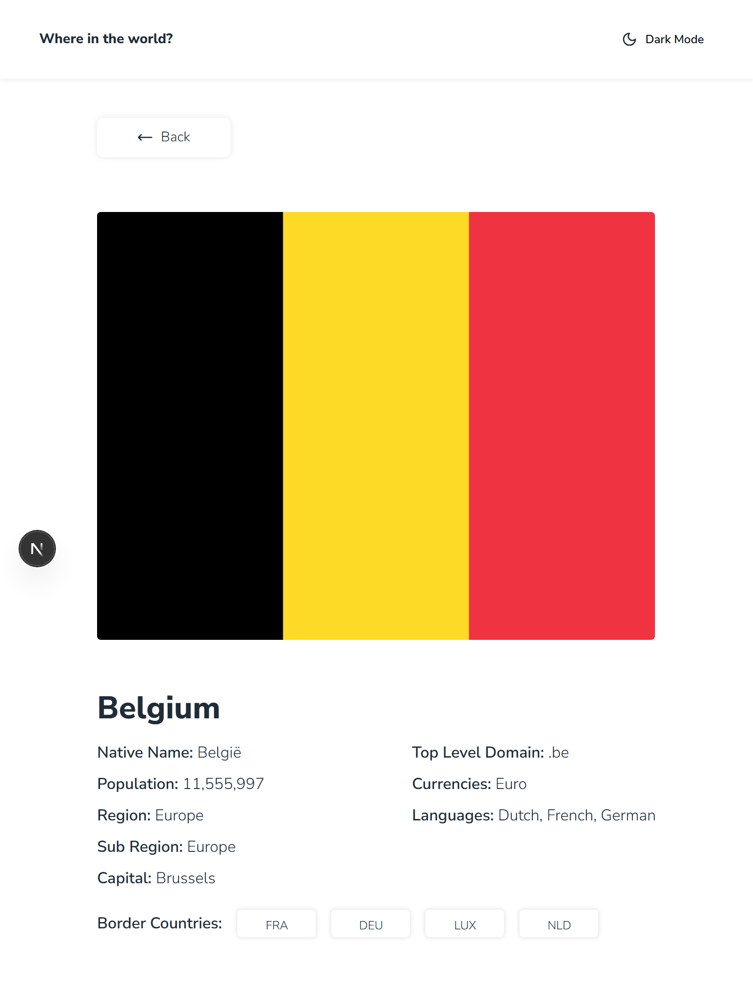
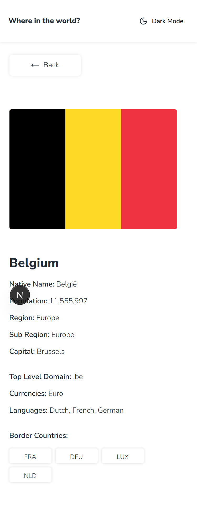

# Frontend Mentor - REST Countries API with color theme switcher solution

This is a solution to the [REST Countries API with color theme switcher challenge on Frontend Mentor](https://www.frontendmentor.io/challenges/rest-countries-api-with-color-theme-switcher-5cacc469fec04111f7b848ca). Frontend Mentor challenges help you improve your coding skills by building realistic projects.

## Table of contents

-   [Overview](#overview)
    -   [The challenge](#the-challenge)
    -   [Screenshot](#screenshot)
    -   [Links](#links)
-   [Getting Started](#getting-started)
    -   [Built with](#built-with)
    -   [Useful resources](#useful-resources)
-   [Author](#author)

## Overview

### The challenge

Users should be able to:

-   See all countries from the API on the homepage
-   Search for a country using an `input` field
-   Filter countries by region
-   Click on a country to see more detailed information on a separate page
-   Click through to the border countries on the detail page
-   Toggle the color scheme between light and dark mode _(optional)_

### Screenshot

<table>
 <tr>
    <th>Desktop</th>
    <th>Tablet</th>
    <th>Mobile</th>
  </tr>
  <tr>
    <td></td>
    <td></td>
    <td></td>
  </tr>
</table>

### Links

-   Solution URL: [Link](https://github.com/olaide-hok/countries/)
-   Live Site URL: [Link](https://app-countries-details.netlify.app/)

## Getting Started

First, run the development server:

```bash
npm run dev
# or
yarn dev
# or
pnpm dev
# or
bun dev
```

Open [http://localhost:3000](http://localhost:3000) with your browser to see the result.

### Built with

-   Semantic HTML5 markup
-   CSS custom properties
-   Flexbox
-   CSS Grid
-   Mobile-first workflow
-   [React](https://reactjs.org/) - JS library
-   [Next.js](https://nextjs.org/) - React framework

### Useful resources

-   [Next.js Documentation](https://nextjs.org/docs) - learn about Next.js features and API.
-   [Learn Next.js](https://nextjs.org/learn) - an interactive Next.js tutorial.

## Author

-   Website - [Habeeb Kareem](https://habeeb-dev.netlify.app)
-   Frontend Mentor - [@olaide-hok](https://www.frontendmentor.io/profile/olaide-hok)
